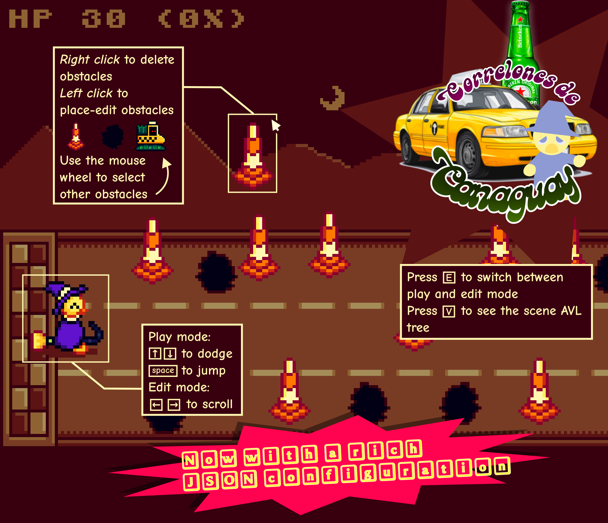

# 🚕🔥 correlones-de-canaguay

Create your own cursed roads and laugh as your character crashes into everything.

## 🎮️ Running

Getting started is super simple:

    python main.py

Make sure you have the required dependencies installed first

## ⚒️ Features

- Create ridiculous, impossible tracks.
- Peek at the AVL scene tree whenever you want
- Pure fun in a few lines of code.

## Docs

Adding those was tricky, but it's worth it

[Github Pages docs](https://alex461538.github.io/correlones-de-canaguay/)

## 📜 License

This project is licensed under the MIT license, basically, if you accomplish to understand it, you can do whatever you want as long as you retain the original license text.